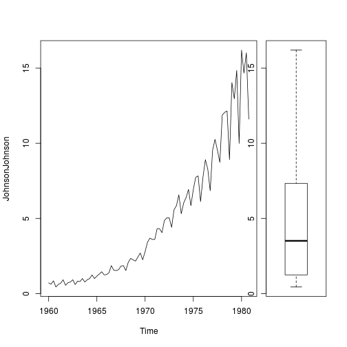

J&J quarterly earnings evolution
========================================================
author: Gabriele Gelsomini
date: 25/06/2017
autosize: true

Idea definition
========================================================

Starting from the database "JohnsonJohnson", I tought about going through a short analysis to understand the composition and the evolution of the company's quarterly earnings, from 1960 to 1980.

The analysis process followed 2 steps: 

- A simple and static exploratory analysis

- Creation of a shiny app going from a static analysis framework to a dynamic one 


Exploratory Analysis - Data
========================================================

Here we can see a summary of the dataset

 

```
   Min. 1st Qu.  Median    Mean 3rd Qu.    Max. 
  0.440   1.248   3.510   4.800   7.132  16.200 
```


Exploratory Analysis - Graphs
=========================================================

Quarterly earnings evolution through time and a boxplot.



But this is a static environment, it would be interesting to be able to modify some inputs having a quick response in the graphs.


Dynamic framework
========================================================

To do that I developped a shiny app that let you modify 2 inputs:

- Time horizon of the analysis, giving you the opportunity to have a look at the 2 graphs for a subset of the data. It is possible to do that through a slider with min and max limits.

- Regression line overlay, giving you the possibility to add a trend line for the specific time horizon you've defined. It is possible to do that through a checkbox option.

Here is the link to the [application](https://gabgel.shinyapps.io/ddp_project/) and to the [code](https://github.com/gabgel/DevelopingDataProductAssignments/tree/master/project).

Use the tab to navigate between the "How to use" and the "App" tab.

Thank you!


